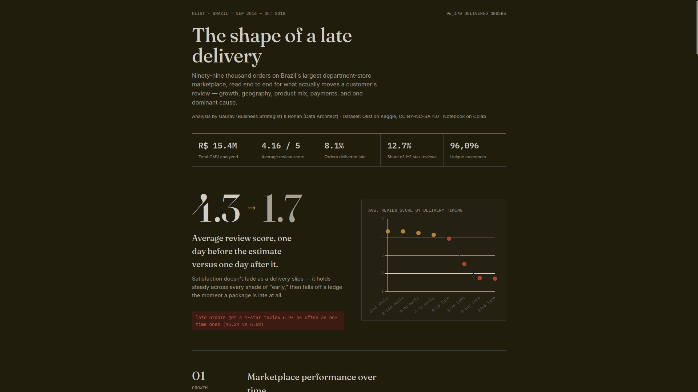
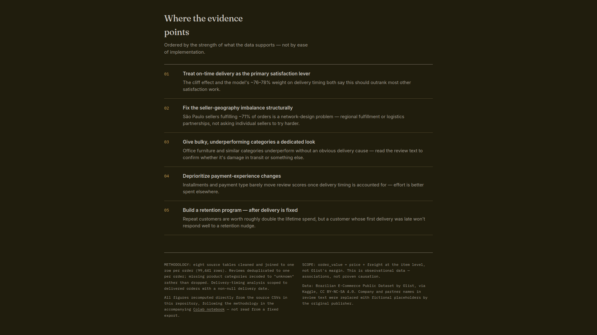
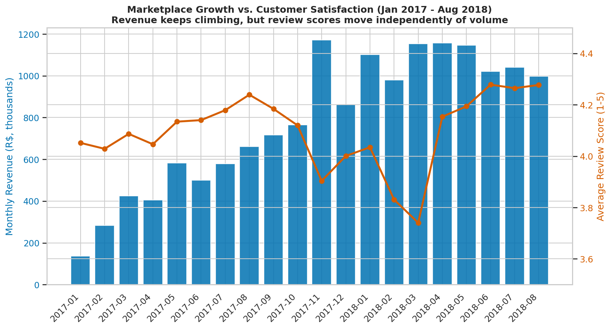
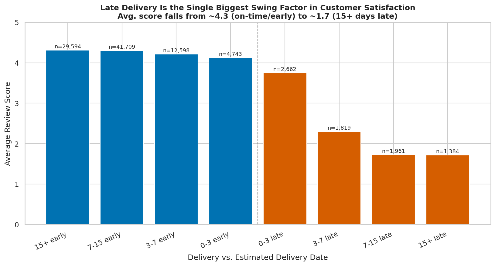
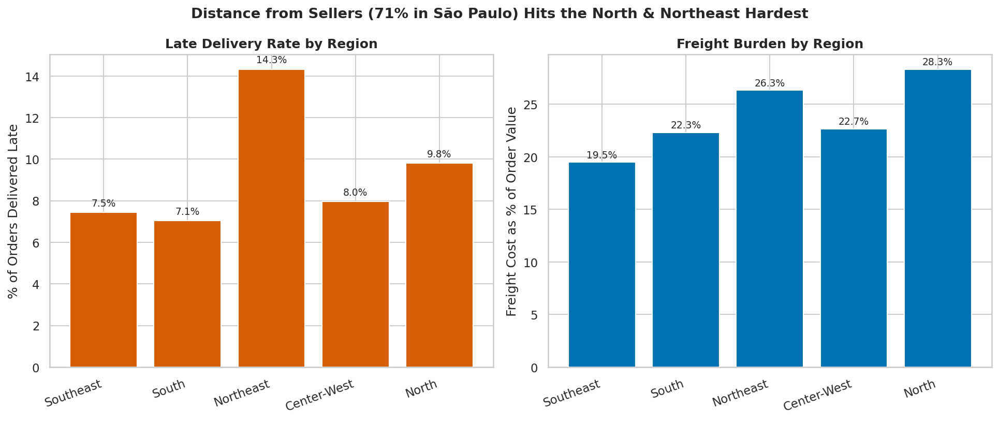
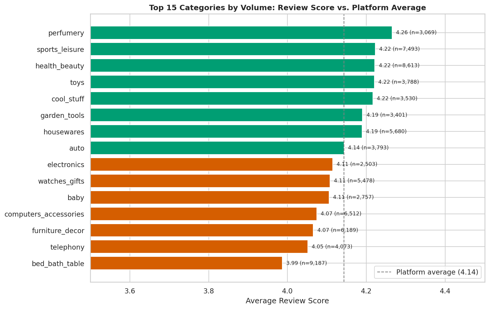
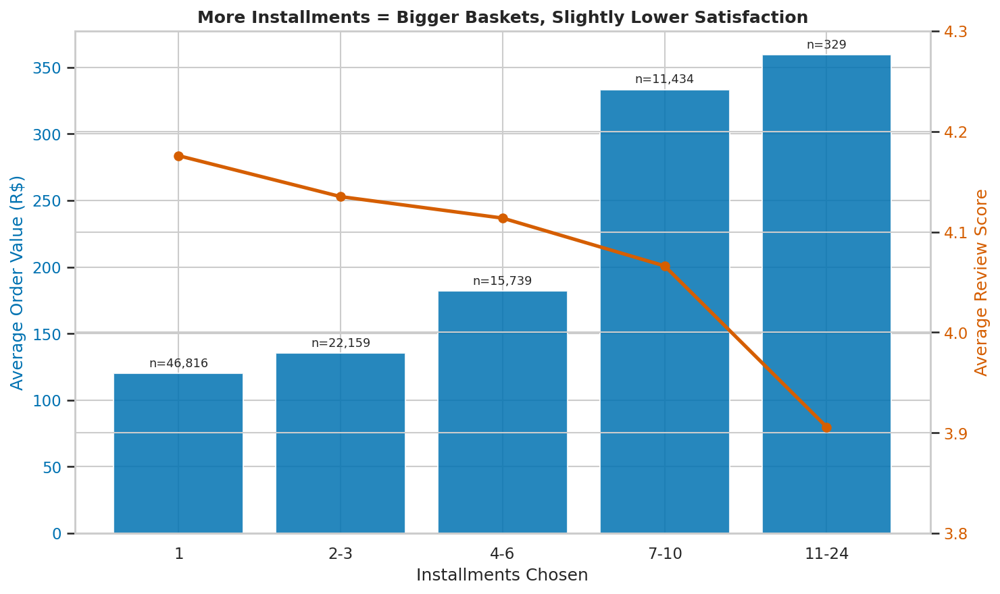
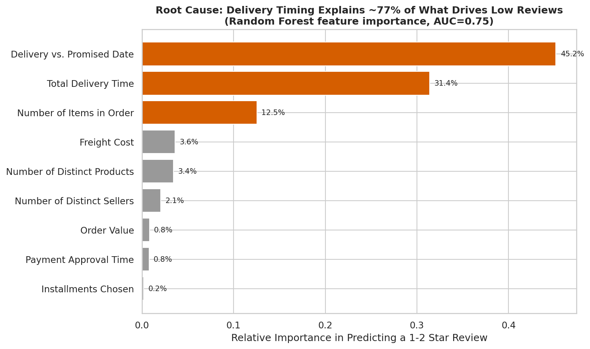

# Olist Marketplace Performance & Customer Satisfaction Analysis

An end-to-end analysis of ~99,441 orders on Olist, Brazil's largest department-store marketplace — what's driving growth, and what's actually driving customer complaints.

[](https://colab.research.google.com/drive/1nlxpwo3AwQFgWrKd_scdKQaPuI0PRGtg?usp=sharing)


### 🚀 [View the Live Interactive Dashboard](https://gaurav-n-patil.github.io/Data-Analysis-Olist-Problem/dashboard/)
**https://gaurav-n-patil.github.io/Data-Analysis-Olist-Problem/dashboard/**
### Dashboard Preview



### Final Findings  



**Analysts:** Gaurav (Business Strategist) & Rohan (Data Architect)
**Dataset:** [Brazilian E-Commerce Public Dataset by Olist](https://www.kaggle.com/datasets/olistbr/brazilian-ecommerce) (Kaggle, CC BY-NC-SA) — 99,441 orders, Sep 2016 – Oct 2018
**Notebook:** [Run the full analysis in Google Colab](https://colab.research.google.com/drive/1nlxpwo3AwQFgWrKd_scdKQaPuI0PRGtg?usp=sharing)

---

## Table of Contents

1. [Overview](#overview)
2. [Key Findings at a Glance](#key-findings-at-a-glance)
3. [About the Dataset](#about-the-dataset)
4. [Methodology](#methodology)
5. [Q1: Marketplace Performance Over Time](#q1-marketplace-performance-over-time)
6. [Q2: Delivery Performance and Customer Satisfaction](#q2-delivery-performance-and-customer-satisfaction)
7. [Q3: Seller and Geographic Patterns](#q3-seller-and-geographic-patterns)
8. [Q4: Product Category Performance](#q4-product-category-performance)
9. [Q5: Payment Behavior](#q5-payment-behavior)
10. [Q6: Root Cause Analysis](#q6-root-cause-analysis)
11. [Bonus: Repeat Customer Economics](#bonus-repeat-customer-economics)
12. [Summary of Findings](#summary-of-findings)
13. [Recommendations](#recommendations)
14. [Limitations and Scope](#limitations-and-scope)
15. [Repository Structure](#repository-structure)
16. [How to Reproduce This Analysis](#how-to-reproduce-this-analysis)
17. [Credits and Attribution](#credits-and-attribution)

---

## Overview

Olist connects small and medium Brazilian merchants to major marketplaces and handles logistics on their behalf. This report analyzes the public Olist order dataset end-to-end — from raw CSVs to a cleaned, order-level master table — to answer six core business questions about growth, delivery, geography, product mix, payments, and the real root cause of customer dissatisfaction, closing with a machine-learning-based root-cause check and a look at repeat-purchase economics.

Every number and chart below is reproducible from the companion Colab notebook linked above.

## Key Findings at a Glance

- **Late delivery is a cliff, not a gradient.** Average review score holds steady around 4.1–4.3 for every degree of "early," then collapses to ~1.7 the moment a package arrives even slightly late.
- **Delivery timing explains ~76% of what predicts a bad review.** A Random Forest model ranking nine operational features found delivery-related features dominate; order value, payment type, and installments barely register.
- **Geography compounds the problem.** Sellers based in São Paulo fulfill 71% of all delivered orders, while the North and Northeast see nearly double the late-delivery rate and pay up to 28% of order value in freight.
- **Bulky categories underperform.** Bed & Bath, Furniture & Decor, and Computers & Accessories sit below the platform's average review score; lighter categories like Perfumery and Toys sit above it.
- **Retention is a largely untapped lever.** Only 3.0% of customers ever place a second order — but they're worth roughly double the lifetime spend of a one-time buyer.

## About the Dataset

The [Brazilian E-Commerce Public Dataset by Olist](https://www.kaggle.com/datasets/olistbr/brazilian-ecommerce) is real, anonymized commercial data covering 99,441 orders placed between **September 2016 and October 2018**, spread across eight relational tables:

| Table | Rows | Description |
|---|---|---|
| `olist_orders_dataset` | 99,441 | Order status and every timestamp from purchase to delivery |
| `olist_order_items_dataset` | 112,650 | Line items per order — price, freight, seller, product |
| `olist_order_payments_dataset` | 103,886 | Payment type and installment count per order |
| `olist_order_reviews_dataset` | 100,000 | Post-delivery review score and comments |
| `olist_customers_dataset` | 99,441 | Customer location, plus a person-level unique ID |
| `olist_products_dataset` | 32,951 | Product category, weight, and dimensions |
| `olist_sellers_dataset` | 3,095 | Seller location |
| `product_category_name_translation` | 71 | Portuguese → English category names |

**Data quality pass (before any chart was trusted):**
- 827 duplicate `review_id`s were found and deduplicated to one row per `order_id`, keeping the most recent response.
- 610 of 32,951 products had no category — recoded to `"unknown"` rather than dropped, so orders aren't lost from revenue totals, but `"unknown"` is excluded from category-level conclusions.
- Nulls in delivery timestamps are overwhelmingly non-`delivered` orders — all delivery-timing analysis is scoped to `order_status == 'delivered'` with a non-null delivery date.
- Price outliers up to R$6,735 and freight outliers up to R$409.68 were checked and kept as legitimate (premium goods, remote-region shipping).
- No full-row duplicates were found in any of the eight core tables.

After cleaning and scoping to delivered orders:

| Metric | Value |
|---|---|
| Delivered orders | 96,478 (97.0%) |
| Total GMV (price + freight) | R$ 15,419,773.75 |
| Average order value | R$ 159.83 |
| Average review score | 4.14 / 5 |
| Share of 1–2 star reviews | 13.2% |
| Share of orders delivered late | 8.1% |
| Unique customers (person-level) | 93,358 |
| Unique sellers | 3,095 |

## Methodology

1. **Load** the eight CSVs and translate product categories to English.
2. **Clean**: deduplicate reviews, recode missing categories, parse all date columns, scope delivery-timing metrics to delivered orders only.
3. **Aggregate to order grain**: items and payments are rolled up from line-item level to one row per order (item count, total price, total freight, seller/product diversity, payment type, installments).
4. **Build a master order-level table** joining orders, customers, the item/payment aggregates, and the deduplicated review score — 99,441 rows × 33 columns.
5. **Derive features**: `delivery_delta_days` (actual vs. estimated delivery), `delivery_time_days` (purchase to delivery), `is_late`, a 5-region mapping of Brazil's 27 states, and freight as a percentage of order value.
6. **Analyze** each business question with grouped aggregations and matplotlib/seaborn visualizations.
7. **Root-cause check**: a `RandomForestClassifier` (300 trees, max depth 6, class-balanced) predicts a 1–2 star review from nine pre-review operational features, ranked by feature importance.

Tools: Python, pandas, NumPy, matplotlib, seaborn, scikit-learn.

---

## Q1: Marketplace Performance Over Time

*How have order volume, revenue, and review scores trended? Do they tell the same story?*


*Figure 1: Monthly revenue (bars, left axis) against average review score (line, right axis), January 2017 – August 2018. Pilot months in 2016 and the partial final month are excluded for readability.*

**Finding:** Revenue grows steadily, with a clear Black Friday spike in November 2017. Review scores, however, dip sharply during that same spike and again in February–March 2018 with no corresponding drop in volume. Growth and satisfaction move independently and need to be tracked as two separate signals, not one.

## Q2: Delivery Performance and Customer Satisfaction

*How does delivery timing relative to the estimated date relate to review scores?*


*Figure 2: Average review score across eight delivery-timing buckets, from 15+ days early to 15+ days late.*

**Finding:** This is a *cliff*, not a gradient. The score is stable — between roughly 4.1 and 4.3 — across every degree of "early," then collapses the moment an order is even slightly late, bottoming out around 1.7 for packages 15+ days late. Late orders receive a 1-star review at roughly **7 times** the rate of on-time orders (46.7% vs. 6.8%).

## Q3: Seller and Geographic Patterns

*Sellers and customers are not evenly distributed across Brazil — how does that relate to delivery, freight, and satisfaction?*


*Figure 3: Late-delivery rate (left) and freight cost as a percentage of order value (right), by customer region.*

**Finding:** São Paulo-based sellers fulfill **71%** of all delivered orders, despite SP customers accounting for only 42% of order volume and SP sellers making up just 60% of the unique seller base — the average SP seller processes disproportionately more volume than a seller elsewhere. The knock-on effect lands hardest away from the Southeast: the Northeast's late-delivery rate (14.3%) is nearly double the Southeast's (7.5%), and North/Northeast customers pay 26–28% of order value in freight versus ~19.5% in the Southeast. This reads as a structural, network-design issue — not a seller-by-seller performance problem.

| Region | Orders | Late Rate | Freight % of Order Value | Avg. Review |
|---|---:|---:|---:|---:|
| Southeast | 66,200 | 7.5% | 19.5% | 4.17 |
| South | 13,814 | 7.1% | 22.3% | 4.18 |
| Northeast | 9,044 | 14.3% | 26.3% | 3.95 |
| Center-West | 5,624 | 8.0% | 22.7% | 4.12 |
| North | 1,796 | 9.8% | 28.3% | 4.02 |

## Q4: Product Category Performance

*How do order volume, price, and review scores differ across categories?*


*Figure 4: Average review score for the 15 highest-volume categories, against the platform average of 4.14.*

**Finding:** Bulky, heavier categories underperform: Bed & Bath — the single largest category by volume at 9,187 orders — sits below average at 3.99, alongside Furniture & Decor (4.07) and Computers & Accessories (4.07). Lighter, easier-to-ship categories lead: Perfumery (4.26), Sports & Leisure, Health & Beauty, Toys, and Cool Stuff all cluster around 4.22.

Looking beyond the top-15-by-volume view, `office_furniture` is the platform's clearest outlier: a 3.64 average review (half a star under the platform average) despite an unremarkable late-delivery rate — pointing to a product problem (damage in transit, assembly complaints) rather than a logistics one.

| Category | Orders | Avg. Review | vs. Platform |
|---|---:|---:|---:|
| office_furniture | 1,251 | 3.64 | −0.50 |
| fashion_male_clothing | 106 | 3.79 | −0.35 |
| audio | 344 | 3.83 | −0.31 |
| furniture_mattress_and_upholstery | 37 | 3.89 | −0.25 |
| home_confort | 365 | 3.92 | −0.23 |

*Weakest categories platform-wide (minimum 30 orders), regardless of volume rank.*

## Q5: Payment Behavior

*How do payment type and installment count relate to order value and the rest of the customer experience?*


*Figure 5: Average order value (bars, left axis) and average review score (line, right axis) across five installment-count buckets.*

**Finding:** Higher installment counts correlate with larger order values (r = 0.32) and a mild dip in review score — from 4.18 at 1 installment down to 3.91 at 11–24 installments. This looks like a byproduct of *what* gets bought in installments (bigger, bulkier, slower-shipping items) rather than financing friction on its own. Payment type tells a similar story: credit card, boleto, debit card, and voucher all average within 0.1 points of each other on review score.

## Q6: Root Cause Analysis

*What operational factors are most associated with a low review score? A Random Forest ranks nine pre-review features.*


*Figure 6: Relative feature importance from a Random Forest classifier (AUC = 0.75) predicting a 1–2 star review.*

**Finding:** Delivery timing (`delivery_delta_days` + `delivery_time_days`) accounts for **~76%** of the model's combined predictive signal — the primary driver, by a wide margin. Order complexity (`n_items`, `n_products`, `n_sellers`) is a secondary contributor at ~18%. Order value, payment approval time, and installment count are **not meaningful drivers** (under 1% each) — despite often being the intuitive first suspects.

*Note: this is observational data, not a controlled experiment — an AUC of 0.75 is decent-but-not-high discriminative power. This ranks primary vs. secondary drivers well; it is not causal proof.*

## Bonus: Repeat Customer Economics

*The dataset distinguishes an order-level `customer_id` from a person-level `customer_unique_id` — what does that reveal about repeat purchase behavior?*

**Finding:** Of 93,358 unique customers, only **2,801 (3.0%)** ever place a second order — but they spend nearly double over their lifetime (R$308.53 vs. R$160.73 for one-time buyers), contributing 5.6% of total revenue from just 3.0% of the customer base. This is a meaningfully under-exploited retention opportunity, best pursued *after* the delivery-timing fixes land — a customer whose first delivery was late is unlikely to respond well to a retention nudge.

---

## Summary of Findings

1. **Delivery timing is the dominant, near-single cause of dissatisfaction** — a cliff effect, not a gradient, explaining ~76% of what a model can use to predict a bad review.
2. **Geography compounds the problem structurally**: São Paulo-based sellers fulfill 71% of orders (vs. ~60% of the unique seller base, vs. SP's 42% share of customers) — the North and Northeast see nearly double the late-delivery rate and up to 28% freight burden as a result.
3. **Category matters at the margin**: bulky/heavy categories (Bed & Bath, Furniture, Computers & Accessories) underperform; lighter categories (Perfumery, Toys) outperform.
4. **Payment behavior is a weak signal**: installment count and payment type barely move review scores once delivery timing is accounted for.
5. **Retention is a largely untapped lever**: only 3% of customers return, but they're worth ~2x lifetime value — a lower-priority but high-upside track once delivery is fixed.

## Recommendations

These follow directly from the findings above and are ordered by where the evidence points hardest:

1. **Treat on-time delivery as the primary satisfaction lever, not one input among many.** Given the cliff effect in Q2 and the ~76% model weight in Q6, investments that tighten the gap between estimated and actual delivery dates should outrank most other satisfaction initiatives.
2. **Address the seller-geography imbalance directly.** The Q3 findings point to a structural fix — such as regional fulfillment or logistics partnerships closer to the North/Northeast — rather than pushing individual sellers to "try harder."
3. **Give `office_furniture` (and similarly bulky categories) a dedicated look.** Since delivery delay doesn't explain its underperformance, the next step is qualitative: read the review text for this category specifically to confirm whether it's damage-in-transit, assembly complaints, or something else.
4. **Deprioritize payment-experience changes as a satisfaction fix.** Q5 and Q6 both show installments and payment type have minimal bearing on review scores — effort here is better spent elsewhere.
5. **Build a retention program, sequenced after delivery fixes.** With repeat customers worth ~2x lifetime value but only 3% of the base, this is real upside — but the Bonus section's own caveat applies: don't court a customer with a retention nudge before their delivery experience is fixed.

## Limitations and Scope

This is observational data, not a controlled experiment — everything above is a strong, well-evidenced **association**, not proven causation. The Q6 Random Forest (AUC = 0.75) is good evidence for ranking primary vs. secondary drivers, but it is not causal proof. A few scoping calls worth stating plainly:

- `order_value` throughout means price + freight at the item level — transaction value, not Olist's actual margin or net revenue.
- Pilot months (late 2016) and the partial final month were excluded from the Q1 time-trend view for readability; they represent a small share of total orders.
- Analysis used state/region-level geography, not the raw `geolocation` lat/lng table — a haversine seller-to-customer distance calculation is a natural next step if there's time.
- Review comment text was loaded but not text-mined in this pass — the obvious next move for digging into *why* `office_furniture` underperforms specifically.
- The Q4 "weakest categories" cut and the Q6 model use slightly different minimum-order thresholds (30 vs. no explicit floor beyond the train/test split); both are reasonable for their purpose but can cause category counts to differ slightly across sections.

## Repository Structure

```
.
├── README.md                 # This report
├── data/*.csv                # contains all csv files dataset
└── charts/
        ├── q1_marketplace_growth_vs_satisfaction.png
        ├── q2_late_delivery_cliff_effect.png
        ├── q3_regional_delivery_and_freight.png
        ├── q4_category_review_scores.png
        ├── q5_installments_vs_value_and_review.png
        └── q6_root_cause_feature_importance.png
```

## How to Reproduce This Analysis

**Option 1 — Google Colab (recommended):**
1. Open the [notebook in Colab](https://colab.research.google.com/drive/1nlxpwo3AwQFgWrKd_scdKQaPuI0PRGtg?usp=sharing).
2. Run the first cell — it mounts your Google Drive and looks for the data automatically.
3. Run all cells top to bottom; every chart in this report is regenerated inline.

**Option 2 — Local Jupyter:**
1. Download the nine CSVs from the [Kaggle dataset page](https://www.kaggle.com/datasets/olistbr/brazilian-ecommerce) into a folder named `Olist_Data/` next to the notebook.
2. `pip install pandas numpy matplotlib seaborn scikit-learn`
3. Run the notebook top to bottom.

## Credits and Attribution

**Analysts:**
- **Gaurav** — Business Strategist
- **Rohan** — Data Architect

**Dataset:** [Brazilian E-Commerce Public Dataset by Olist](https://www.kaggle.com/datasets/olistbr/brazilian-ecommerce), made available on Kaggle under a **CC BY-NC-SA 4.0** license. All data is anonymized real commercial data; company and partner names in review text have been replaced with fictional placeholders by the original publisher.
